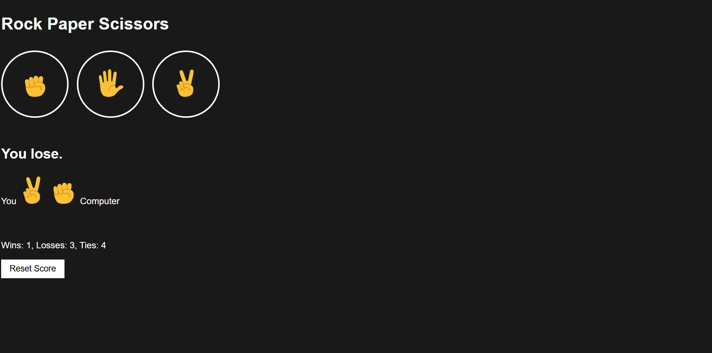

# Rock Paper Scissors

A simple web-based Rock Paper Scissors game built with HTML, CSS, and JavaScript. It features a dark mode theme, emoji icons, and real-time score tracking.

## Preview

## Features

* Interactive button controls using hand emojis.
* Computer AI that makes a random choice every turn.
* Live status display showing the round outcome (Win, Lose, or Tie).
* Visual display comparing your move against the computer's move.
* Persistent score counter tracking total Wins, Losses, and Ties.
* Reset button to clear the score and start over.
* Autoplay button for automation
* Shortcut keys for smooth operability
* Confirmation popups for tasks like reset score to avoid misclicks

## Files

* `index.html` - The structure and layout of the game.
* `style.css` - The dark theme styling and button designs.
* `script.js` - The game logic, computer move generation, and score tracking.

## How to Run

1. Download the project files into the same folder.
2. Open `index.html` in any web browser.
